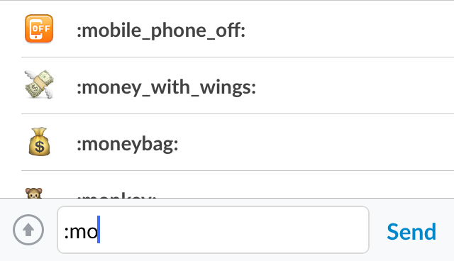
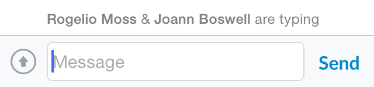
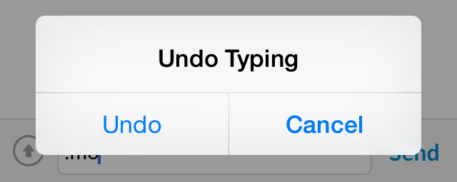
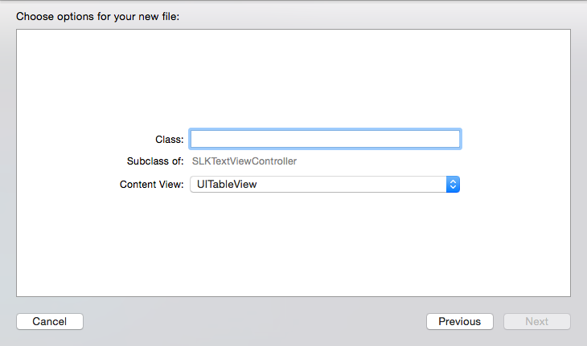

#SlackTextViewController

[](https://cocoadocs.org/docsets/SlackTextViewController)
[](http://opensource.org/licenses/Apache2.0)

A drop-in UIViewController subclass with a growing text input view and other useful messaging features. Meant to be a replacement for UITableViewController & UICollectionViewController.


This library is used in Slack's iOS app. It was built to fit our needs, but is flexible enough to be reused by others wanting to build great messaging apps for iOS.

## Features

### Core
- Works out of the box with UITableView or UICollectionView
- Growing text view, with line count limit support
- Customizable: provides left and right button, and toolbar outlets
- Tap gesture for dismissing the keyboard
- Pan gesture for sliding down the keyboard
- Flexible UI Built with Auto Layout
- Text append APIs

### Optional
- Autocomplete mode by registering any prefix key (`@`, `#`, `/`)
- Edit mode
- Typing indicator display
- Shake gesture for undo
- Image pasting support
- Inverted mode for displaying cells upside-down (using CATransform) -- a necessary hack for some messaging apps (including ours)
- Bouncy animations

### Compatibility
- iOS 7 & iOS 8
- iPhone & iPad
- UIPopOverController & UITabBarController support
- Auto-Rotation & Localization support
- External keyboard support for basic commands

## Installation

Available in [Cocoa Pods](http://cocoapods.org/?q=SlackTextViewController)
```
pod 'SlackTextViewController'
```

##How to use

###Subclassing
`SLKTextViewController` is meant to be subclassed, like you would normally do with UITableViewController or UICollectionViewController. This pattern is a convenient way of extending UIViewController. SlackTextViewController manages a lot behind the scenes while still providing the ability to add custom behaviours. You may override methods, and decide to call super and  perform additional logic, or not to call super and override default logic.

Start by creating a new subclass of `SLKTextViewController`.

In the init overriding method, if you wish to use the `UITableView` version, call:
```
[super initWithStyle:UITableViewStylePlain]
```

or the `UICollectionView` version:
```
[super initWithCollectionViewLayout:[UICollectionViewFlowLayout new]]
```


Protocols like `UITableViewDelegate` and `UITableViewDataSource` are already setup for you. You will be able to call whatever delegate and data source methods you need for customising your control.

Calling `[super init]` will call by default `[super initWithStyle:UITableViewStylePlain]`.


###Growing Text View


The text view expands automatically when a new line is required, until it reaches its `maxNumberOfLines`value. You may change this property's value in the textView.

By default, the number of lines is set to best fit each device dimensions:
- iPhone 4      (<=480pts): 4 lines
- iPhone 5/6    (>=568pts): 6 lines
- iPad          (>=768pts): 8 lines

On iPhone devices, in landscape orientation, the maximum number of lines is changed to 2 to best fit the limited height.

###Autocompletion

We use autocompletion for many things: names, channels, emoji, and more.



To set up autocompletion in your app, follow these simple steps:

#### 1. Registration
You must first register all the prefixes you'd like to support for autocompletion detection:
````
[self registerPrefixesForAutoCompletion:@[@"#"]];
````

#### 2. Processing
Every time a new character is inserted in the text view, the nearest word to the caret will be processed and verified if it contains any of the registered prefixes.

Once the prefix has been detected, `-canShowAutoCompletion` will be called. This is the perfect place to populate your data source, and return a BOOL if the autocompletion view should actually be shown. So you must override it in your subclass, to be able to perform additional tasks. Default returns NO.

````
- (BOOL)canShowAutoCompletion
{
    NSString *prefix = self.foundPrefix;
    NSString *word = self.foundWord;
    
    self.searchResult = [[NSArray alloc] initWithArray:self.channels];
    
    if ([prefix isEqualToString:@"#"])
    {
        if (word.length > 0) {
            self.searchResult = [self.searchResult filteredArrayUsingPredicate:[NSPredicate predicateWithFormat:@"self BEGINSWITH[c] %@ AND self !=[c] %@", word, word]];
        }
    }

    if (self.searchResult.count > 0) {
        self.searchResult = [self.searchResult sortedArrayUsingSelector:@selector(localizedCaseInsensitiveCompare:)];
    }
    
    return self.searchResult.count > 0;
}
````

The auto-completion view is a UITableView instance, so you will need to use `UITableViewDataSource` to populate its cells. You also have total freedom for customizing the UITableViewCells displayed here.

You don't need to call `-reloadData`, since it will be called automatically if you return `YES` in `-canShowAutoCompletion`.

#### 3. Layout

The maximum height of the autocompletion view is set to 140 pts, but you may change the minimum height depending of the amount of cells you are going to display in this tableview.

````
- (CGFloat)heightForAutoCompletionView
{
    CGFloat cellHeight = [self.autoCompletionView.delegate tableView:self.autoCompletionView heightForRowAtIndexPath:[NSIndexPath indexPathForRow:0 inSection:0]];
    return cellHeight*self.searchResult.count;
}
````

#### 4. Confirmation

If the user selects any cells presented in the auto-completion view, calling `-tableView:didSelectRowAtIndexPath:`, you must call `-acceptAutoCompletionWithString:` passing the corresponding string matching that item, that you would be insert in the text view.

`````
- (void)tableView:(UITableView *)tableView didSelectRowAtIndexPath:(NSIndexPath *)indexPath
{
    if ([tableView isEqual:self.autoCompletionView]) {
        
        NSString *item = self.searchResult[indexPath.row];
        
        [self acceptAutoCompletionWithString:item];
    }
}
````

The autocompletion view will automatically be dismissed, and the chosen string will be inserted in the view right after the prefix string.

You can always call `-cancelAutoCompletion` to exit the autocompletion mode.


###Edit Mode


To enable edit mode, you simply need to call `[self editText:@"hello"];`, and the text input will automatically adjust to the edit mode, removing both left and right buttons, extending the view a bit higher with "Accept" and "Cancel" buttons. Both of this buttons are accessible under `SLKTextInputbar` for customisation.

To capture the "Accept" or "Cancel" events, you must override the following methods.

````
- (void)didCommitTextEditing:(id)sender
{
    NSString *message = [self.textView.text copy];
    
    [self.messages removeObjectAtIndex:0];
    [self.messages insertObject:message atIndex:0];
    [self.tableView reloadData];
    
    [super didCommitTextEditing:sender];
}

- (void)didCancelTextEditing:(id)sender
{
    [super didCancelTextEditing:sender];
}
````

Notice that you must call `super` at some point, so the text input exits the edit mode, re-adjusting the layout and clearing the text view.
Use the `editing` property to know if the editing mode is on.


###Typing Indicator



Optionally, you can enable a simple typing indicator, which will be displayed right above the text input. It shows the name of the people that are typing, and if more than 2, it will display "Several are typing" message.

To enable the typing indicator, just call `[self.typeIndicatorView insertUsername:@"John"];` and the view will automatically be animated on top of the text input. After a default interval of 6 seconds, if the same name hasn't been assigned once more, the view will be dismissed with animation.

You can remove names from the list by calling `[self.typeIndicatorView removeUsername:@"John"];`

You can also dismiss it by calling `[self.typeIndicatorView dismissIndicator];`

###Panning Gesture

Dismissing the keyboard with a panning gesture is enabled by default with the `keyboardPanningEnabled` property. You can always disable it if you'd like.

###Shake Gesture



A shake gesture to clear text is enabled by default with the `undoShakingEnabled` property.

You can optionally override `-willRequestUndo`, to implement your UI to ask the users if he would like to clean the text view's text. If there is not text entered, the method will not be called.

If you don't override `-willRequestUndo` and `undoShakingEnabled` is set to `YES`, a system UIAlertView will prompt.

###Inverted Mode

Some UITableView layouts may require that new messages enter from bottom to top. To enable this, you must use the `inverted` flag property. This will actually invert the UITableView or UICollectionView, so you will need to do a transform adjustment in your UITableViewDataSource method `-tableView:cellForRowAtIndexPath:` for the cells to show correctly.

````
- (UITableViewCell *)tableView:(UITableView *)tableView cellForRowAtIndexPath:(NSIndexPath *)indexPath
{
    UITableViewCell *cell = [self.tableView dequeueReusableCellWithIdentifier:chatCellIdentifier];
    
    // Cells must inherit the table view's transform
    // This is very important, since the main table view may be inverted
    cell.transform = self.tableView.transform;
}
````

###External Keyboard

There a few basic key commands enabled by default:
- return key -> calls `-didPressRightButton:` or `-didCommitTextEditing:` if in edit mode
- shift/control + return key -> line break
- escape key -> exits edit mode, or auto-completion mode, or dismisses the keyboard

To add additional key commands, simply override `-keyCommands` and append `super`'s array.

`````
- (NSArray *)keyCommands
{
    NSMutableArray *commands = [NSMutableArray arrayWithArray:[super keyCommands]];
    
    // Edit last message
    [commands addObject:[UIKeyCommand keyCommandWithInput:UIKeyInputUpArrow
                                           modifierFlags:0
                                                   action:@selector(editLastMessage:)]];
    
    return commands;
}
````


##Sample Project

Check out the sample project, everything is demo'd there.


##XCode Templates



We have prepared a set of useful XCode templates so you can quickly start using SlackTextViewController.

To install them, open up your terminal and type:
```sh ./SlackTextViewController/Template/install.sh```

These templates are also available in [Alcatraz](https://github.com/supermarin/Alcatraz).
